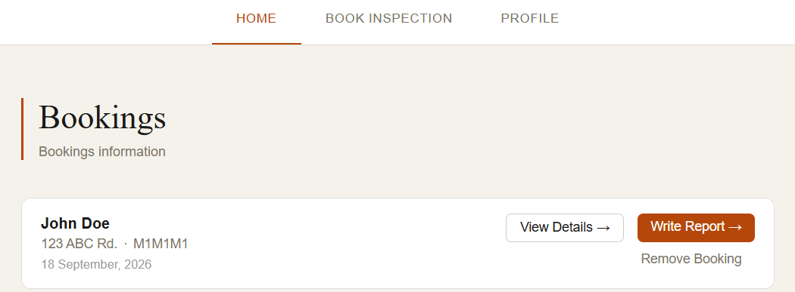
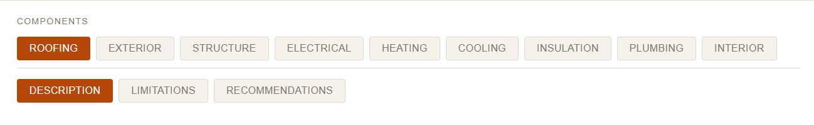
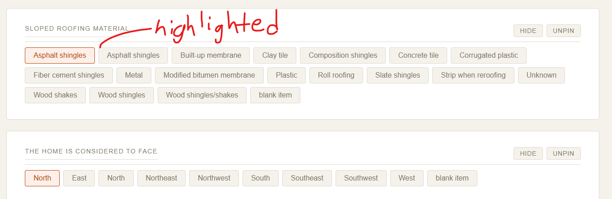
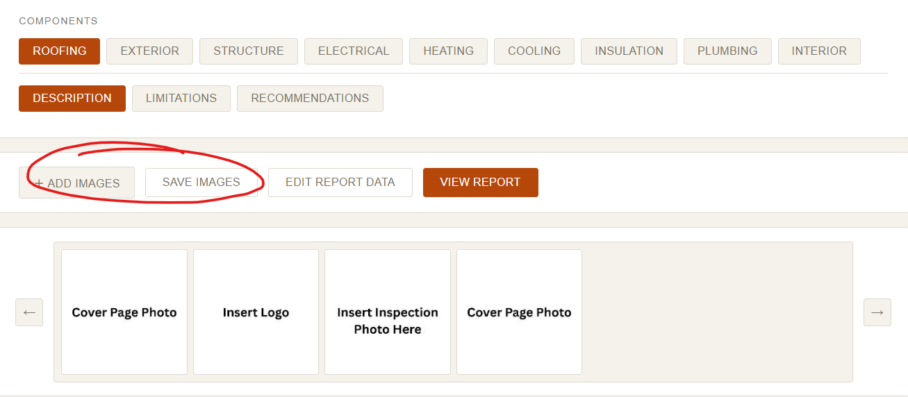
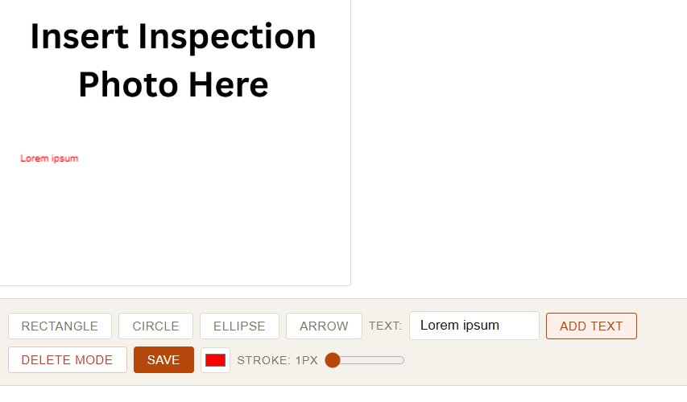
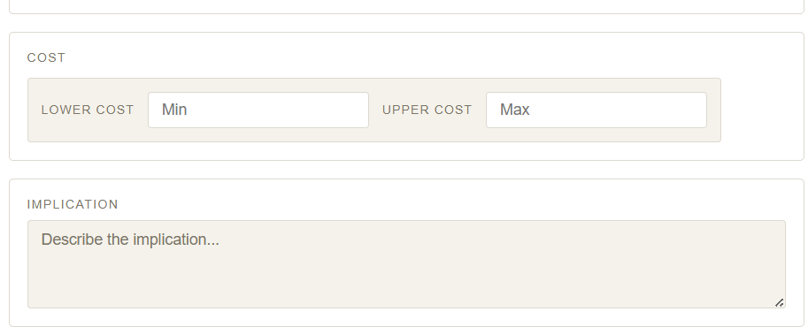
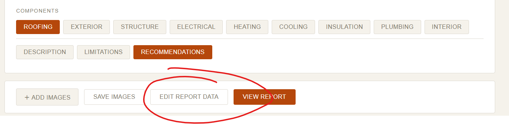

# What is this app?

This app is made to streamline the process of creating reports for home inspectors.
Inspired by the creators father, who is a home inspector.

A boilerplate report can be found here: https://drive.google.com/file/d/11U2yHCU5KACblATe7DGoZfsZfW7DJ_7v/view?usp=drive_link

## Dependencies:

Database: sqlite3
Backend: Java Spring Boot/Python Flask + weasyprint
Setup: Docker desktop/WSL

# Home Inspection App — User Guide

This guide walks through the basics of setting up the app, and how to use it.
The "how to use it" part is designed to be minimal, as hopefully the UI explains it well enough

## 1. Setup

### Data cloning **IMPORTANT**

Clone this repo onto your computer.
This repo only contains necessary database information for the boilerplate of the web application,
there is no user data.
Thus, you have to run the command: sqlite3 database.db < seed/field_definitions.sql to copy the necessary
information into the database.
Make sure you have sqlite3 installed.

### Launching the app

Simply find the start.bat file in the main directory and double click it. If the app does not start within 60 seconds,
go to http://localhost:8080 on your web browser once it does start.

## 2. Profile setup

1. Open the app and click **Profile** in the top navbar.
2. Fill in all sections.
3. Click save.

### Linking Google Calendar (optional)

With a Google account linked, every booking you save is added to your calendar
automatically, and edits or deletions follow it there.

**One-time setup.** The app talks to Google as your own OAuth application, so it
needs credentials:

1. Go to the [Google Cloud Console](https://console.cloud.google.com/), create a
   project, and enable the **Google Calendar API** for it.
2. Under **APIs & Services -> OAuth consent screen**, set the app up as
   **External**, and add your own Google account as a **test user**.
3. Under **APIs & Services -> Credentials**, create an **OAuth client ID** of type
   **Web application**. Add this as an authorised redirect URI, exactly:

   ```
   http://localhost:8080/api/google/calendar/callback
   ```

4. Copy the client id and secret into `home-inspection/.env`:

   ```
   GOOGLE_CLIENT_ID=your-client-id
   GOOGLE_CLIENT_SECRET=your-client-secret
   ```

5. Restart the app.

**Connecting.** Open **Profile**, scroll to **Google Calendar**, and click
**Connect Google Calendar**. Approve the consent screen and you land back on the
profile page, connected. From there you can choose which calendar bookings go to
and switch syncing off without unlinking. **Disconnect** revokes the app's access.

If Google is unreachable when a booking is saved, the booking is still saved --
only the calendar entry is skipped, and the reason is written to the log.

## 2. Booking an Inspection

1. Click **Book Inspection** in the navbar.
2. Fill in all sections
3. Click save.

The **Date of Inspection** card has a date picker beside the month / day / year
fields -- either one updates the other. Dates that don't exist (February 30, and
the like) are refused before the booking is saved. **Start Time** and **Length**
are optional: with a start time the calendar event is a real time block, without
one it becomes an all-day entry.

### Editing or Deleting a Booking

- From the **Home** page, click **View Details →** on any booking card to
  reopen and edit it.
- Click **Remove Booking** on a booking card to delete it permanently.



## 3. Writing the Report

From a booking's card, click **Write Report →** to open the report writing
screen for that booking.

### 3.1 Navigating Components

At the top, two rows of buttons let you pick what you're documenting:

- **Row 1 — Place**: Different places in the house.
- **Row 2 — Type**: Description, Limitations, Recommendations.

Together these filter which fields show below.



### 3.2 Adding Field Values

Each field shows a list of possible values as buttons.
Click a value to record it against this booking's report.

- **Already-selected values** appear highlighted.
- **Right-click** a selected value to delete it.
- **Double-click** a selected value to open the edit panel — from here you
  can:
  - Name the condition, if the value is a **blank item** (see below)
  - Attach or change images (see §3.3)
  - Add a note (free text specific to this field)
  - If the field type is **Recommendations**, set recommendation details
    and toggle whether it appears in the report's summary table (see §3.4)

**Blank items.** All fields offer a **blank item** option for conditions the
canned wording doesn't cover. Double-click a selected blank item and the edit
panel shows a **Condition Name** box: whatever you type there is what the report
prints for that field, and it's kept on that booking only.

Tick **Save as permanent value** beside it to also add the name to that field's
option list — after confirming, it becomes a button you can pick on every future
report. Leaving it unticked keeps the name to this report.

The note field is now free for actual notes on blank items; previously the note
doubled as the item's name.

Fields you use often can be **pinned** so they're always expanded — click
**Pin** on a field's header (toggles to **Unpin**). Fields with existing
values or that are pinned automatically sort to the top and start expanded.



### 3.3 Uploading & Attaching Images

1. Click **+ Add Images**, select one or more photos, then **Save Images**.
   A progress bar shows upload status. Uploaded images appear in the
   horizontal image strip at the top of the page.
2. To attach an image to a specific field: double-click the field's value
   to open its edit panel, then **double-click** an available image in the
   panel's image picker to link it.
3. To remove an image from a field: right-click its thumbnail in the
   field's panel and confirm.
4. To permanently delete an image from the booking: right-click it in the
   main image strip (above the fields) and confirm.



### 3.4 Annotating Images

With a field's edit panel open and an image selected:

1. Choose a tool: **Rectangle**, **Circle**, **Ellipse**, **Arrow**, or
   **Text** (type your text into the box next to "Add Text" first, then
   click **Add Text**).
2. Click and drag on the image to draw the shape (or click once for text).
3. Adjust **color** and **Size** using the controls in the toolbar before
   drawing. Size sets the stroke width for shapes, the text size, and the
   thickness and head size of arrows.
4. Tick **Clip 45°** to snap arrows to the nearest 45° as you draw them,
   for arrows that line up square with the photo.
5. Tick **Fix length** to lock every arrow to the same size — half head, half
   shaft, scaled by the **Size** slider — so dragging only aims it. Handy for
   pointing at something without a long tail across the photo.
   Both options affect arrows only, and can be combined.
6. To remove an annotation, click **Delete Mode**, then click the
   annotation on the image.
7. Click **Save** to persist your annotations.

Annotations are baked into the image when the final PDF is generated.



### 3.5 Recommendations (Type = Recommendations only)

When editing a field under the **Recommendations** type, an extra
**Recommendations** button appears in the edit panel. Click it to open the
recommendations panel:

- **Direction, Floor Level, Room, Task, Time** — click to select multiple
  options per category.
- **Cost** — enter a lower and upper estimate.
- **Implication** — free-text explanation of why this matters / what
  happens if it's not addressed.
- Check **Save as default implication** if you want this implication text
  to auto-fill next time this same field value is selected on *any*
  booking.
- Click **Save and Submit**.

Back in the field's edit panel, check **Include in summary** if this
recommendation should also appear in the report's summary table (a
condensed table of all flagged issues, shown near the front of the PDF).



### 3.6 Editing Report-Level Data

Click **Edit Report Data** (top action bar) to open a separate page where
you can:

- Edit the overall **Summary** text for this specific report (pre-filled
  from your profile's summary letter, but editable per-report).
- Upload a **report-specific Appendix PDF** — this overrides the default
  appendix PDF set on your profile, for this booking only.

Click **Save**, then use the **back arrow / navbar** to return to the
report writing screen.



## 4. Generating the Final PDF

From the report writing screen, click **View Report** at any time to
generate and preview the PDF.